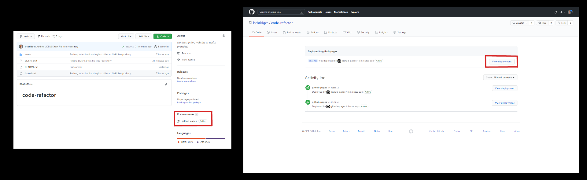
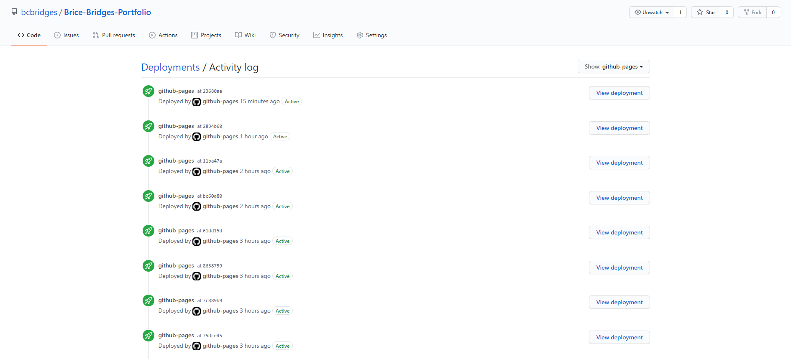

# [Brice-Bridges-Portfolio](https://bcbridges.github.io/Brice-Bridges-Portfolio/) Webpage

## Description of Project

This portfolio was designed to practice HTML & CSS markup, and for creating a beginning portfolio for our future projects.

### index.html

- The html was designed with flexbox layout in mind.
- Semantic tags were used when logical, and classes and ids were used in replacement of semantic elements when not available.

### style.css

- To create a responsive layout, fixed units (such as pixels) were avoided when possible. Relative based units (such as viewport and percentages) were used widely.
- Comments were used when possible in the css document to make logical breaks within the code for future devs.
- CSS variables were used throughout the rulesets to keep consistent, easy to call colors.

## Installation and Access

There is no required software installation necessary to access the code or GitHub published webpage. To access the webpage, either click the 'Brice-Bridges-Portfolio' link at the top of this readme or go to this link https://bcbridges.github.io/Brice-Bridges-Portfolio/. To manually access the webpage from the repository home page, click the 'github-pages' under the 'Environments' tab (Image 1). Once on the 'Deployments' page (Image 2), you may now view any historical deployment/update to the web page as well, with the most recent update at the top.

### Image 1

### Image 2

The index.html can be accessed [here](index.html), & the style.css can be accessed [here](./assets/style.css).

## License

Copyright (C) 2021 Brice Bridges - the full license can be viewed [here](license.txt)
